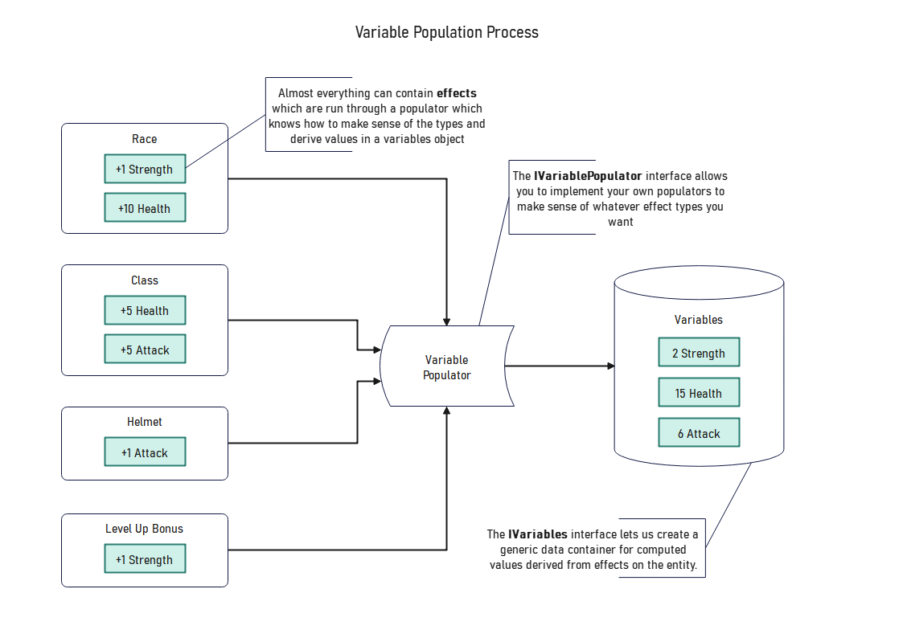
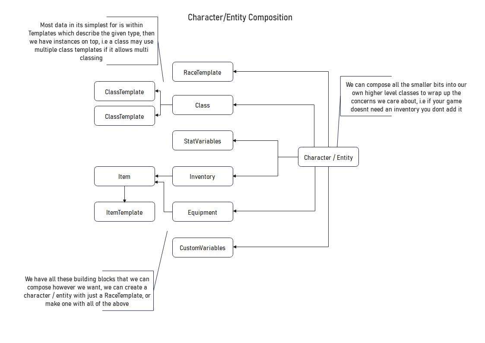

# OpenRpg.Core

The core library is really there to provide things that almost all RPG based games will require, as well as adding conventions for other libraries to build off.

> It is recommended you check out the web demo version to see more use cases and explanations https://openrpg.github.io/OpenRpg.Demos.Web/

--- 

## Generic Functionality

### `Variables`

Variables act as generic keyed data containers for you to put various data in that can be expanded upon downstream, i.e you can store your stats in them without stipulating what they are up front, then in your application decide which index should be which thing.

Variables can be manually set or computed by taking effects and other variables and output computed results, this is kind of how we separate base and active stats, for example you may have a race with `+5 strength`, a class with `+4 strength` and a helmet that gives you `+1 strength`, so we can compute all this together using an `IComputedVariablePopulator` so then you can just look in the computed variables and see the strength is `10`.

> In complex scenarios you may have multistage computed steps, i.e you compute the base stats from race/class, then pass that in with equipment effects, then pass that in with active spell effects allowing you to only regenerate the layer that has changed.

### `Localization`

There are a few bits under this heading but out the box it doesnt expect things to have hard coded text strings, it expects locale codes which you can provide to the locale repository to get the actual text for your given locale, i.e if you had a `long sword` item in spanish it would be something like `espada larga` or in german `Langschwert`so you can instead use a code like `long-sword` and then if you were to lookup `long-sword` with `en` you get `long sword` text, but if you are using `es` you would get `espada larga`.

### `IRepository`

This provides some conventions for storing and accessing data, out the box there is an `InMemoryRepository<T>` which would ideally be used as a way to load all your games items, enemies, skills, races, classes, locales etc. There are also the notion of queries which let you get custom data back from the repositories, so if you were leveling up your character and you wanted to know all classes that your character meets requirements for etc.

Although there is an out the box repository implementation it is up to you to implement your own versions if you want to access databases, webservices etc, the same interfaces should still be applicable.

---

## Rpg Model Related Data

### `Requirements`

Almost everything can have a requirement, be it an effect on an item, a class your character could pick, a quest pre-requisite etc, they are flexible and allow you to setup your own requirement types, such as requiring a level before you can do a quest, or only allowing an item to be used by someone with a given race or class etc.

### `Effects`

These are high level effects that would end up effecting your entities (characters, npcs etc), these are all set to be configurable where you provide a type of effect and how potent it is, these can then be applied to various parts of the system, such as having an item which by default does 10% fire damage, or a racial bonus of 5 strength points, you could even use it as the basis to make modifications to weapons.

### `Classes`

In most RPG games you have a class, its up to you if you make your character have a single class or multiple classes, as mentioned above the whole point of this library is to be composable and just provide the building blocks that you put together yourself.

### `Races`

Again most RPG games have the notion of races, be it fantasy races like elves, dwarves etc or sci fi alien races you make up yourself.

## Higher Level Data

This is more for the genres but you are free to compose your data however you see fit, the `Genres` libs provide some pre made conventions for a lot of this for you however you can bypass them and just use the bits you care about directly if you want, but regardless of your approach you will often end up with something like this.

